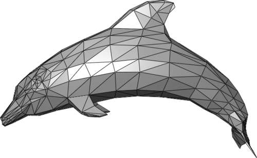

# Mesh

In this chapter, we’ll learn how to work with polygon meshes—often simply called meshes. Most real-time graphics systems—like OpenGL, Vulkan, WebGPU, and game engines—expect 3D objects to be provided as meshes, so mastering them is essential for rendering and geometric processing.

<small>Source: [Polygon mesh](https://en.wikipedia.org/wiki/Polygon_mesh)</small>

## What is a mesh?

A mesh is one of the most common ways to represent 3D shapes. It’s made of:

- [Vertices](https://en.wikipedia.org/wiki/Vertex_(geometry)) (points in 3D space)
- [Edges](https://en.wikipedia.org/wiki/Edge_(geometry)) (lines connecting vertices)
- [Faces](https://en.wikipedia.org/wiki/Face_(geometry)) (usually triangles or quads)

## Why meshes?

Truck supports two broad categories for representing shapes:

- **Polygon meshes**: great for rendering, simple geometric manipulation, and interoperability with game engines, viewers, and simulation tools. Truck uses a mesh format based on [Wavefront OBJ](https://en.wikipedia.org/wiki/Wavefront_.obj_file), one of the easiest and most widely supported formats in 3D graphics.
- **Boundary representations ([B-rep](https://en.wikipedia.org/wiki/Boundary_representation))**: describe shapes using curved surfaces (like [NURBS](https://en.wikipedia.org/wiki/Non-uniform_rational_B-spline)), edges, and [topology](https://en.wikipedia.org/wiki/Topology) information. They are powerful for CAD and engineering, but not directly friendly for GPUs.

## Converting shapes to meshes

If you create a model using B-rep, [CSG](https://en.wikipedia.org/wiki/Constructive_solid_geometry), or another high-level representation, you usually need to convert it into a mesh before you can display it. This is normal—it's what almost every CAD or modeling program does behind the scenes.

Truck includes tools (see [truck-meshalgo](https://github.com/ricosjp/truck/tree/master/truck-meshalgo)):

- Generating meshes from other representations ([traits](https://doc.rust-lang.org/book/ch10-02-traits.html) like `MeshableShape`, `RobustMeshableShape`, `MeshedShape` in `src/tessellation/mod.rs`; example driver: `examples/tessellate-shape`)
- Completing missing normals (`NormalFilters` in `src/filters/normal_filters.rs` with `add_naive_normals`, `add_smooth_normals`, `normalize_normals`, etc.)
- Simplifying/filtering mesh data (`OptimizingFilter`, `StructuringFilter`, `Subdivision` in `src/filters/mod.rs` with implementations such as `optimizing.rs` for removing unused attrs/degenerate faces, unifying shared verts, subdividing, etc.)

These operations make your meshes cleaner, smaller, and faster to render.

## A note about non-mesh rendering

While meshes are the standard, other representations exist—especially for special effects or [procedural](https://en.wikipedia.org/wiki/Procedural_generation) visuals. For example, [raymarching](https://en.wikipedia.org/wiki/Ray_marching) can visualize shapes defined mathematically by:

- [Signed distance fields (SDFs)](https://en.wikipedia.org/wiki/Signed_distance_function)
- [Implicit surfaces](https://en.wikipedia.org/wiki/Implicit_surface)
- [Fractal](https://en.wikipedia.org/wiki/Fractal) formulas

These approaches don’t use polygons at all. However, they’re less common for CAD or engineering purposes, which is why meshes remain the primary representation in Truck.
