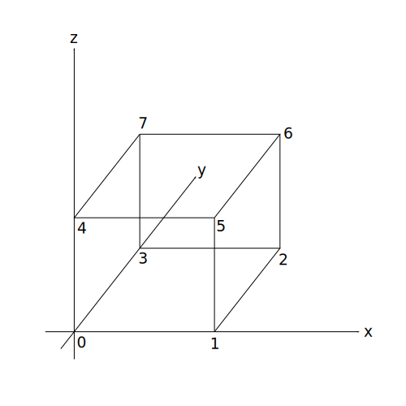

# Hexahedron (Cube)

## Add the hexahedron module

`src/lib.rs` additions:

```rust
use std::iter::FromIterator;
use truck_meshalgo::prelude::*;

// ...keep earlier functions: write_polygon_mesh, triangle, square, tetrahedron...
pub mod hexahedron; //add this
pub use hexahedron::hexahedron; //add this
```

## Construct Main Function

`src/hexahedron.rs`:

```rust
use std::iter::FromIterator;
use truck_meshalgo::prelude::*;

/// Unit cube (hexahedron) using quads.
pub fn hexahedron() -> PolygonMesh {

    //PLACE STEP 1-4 HERE

}
```

#### Step 1: Define vertex positions
```rust
    let positions = vec![
        Point3::new(0.0, 0.0, 0.0),
        Point3::new(1.0, 0.0, 0.0),
        Point3::new(1.0, 1.0, 0.0),
        Point3::new(0.0, 1.0, 0.0),
        Point3::new(0.0, 0.0, 1.0),
        Point3::new(1.0, 0.0, 1.0),
        Point3::new(1.0, 1.0, 1.0),
        Point3::new(0.0, 1.0, 1.0),
    ];
```
#### Step 2: Build attribute set
```rust
    let attrs = StandardAttributes {
        positions,
        ..Default::default()
    };
```
#### Step 3: Define mesh faces
```rust
    let faces = Faces::from_iter([
        [3, 2, 1, 0], // bottom
        [0, 1, 5, 4], // front
        [1, 2, 6, 5], // right
        [2, 3, 7, 6], // back
        [3, 0, 4, 7], // left
        [4, 5, 6, 7], // top
    ]);
```




#### Step 4: Construct the mesh
```rust
    PolygonMesh::new(attrs, faces)
```

## Export the cube

Add `examples/hexahedron.rs`:

```rust
fn main() {
    let mesh = truck_meshes::hexahedron();
    truck_meshes::write_polygon_mesh(&mesh, "output/cube.obj");
}
```

Run it:

```bash
cargo run --example hexahedron
```

<details>
<summary>File tree after this step</summary>

```
truck_meshes/
├─ Cargo.toml
├─ src/
│  ├─ lib.rs
│  ├─ triangle.rs
│  ├─ square.rs
│  ├─ tetrahedron.rs
│  └─ hexahedron.rs
├─ examples/
│  ├─ triangle.rs
│  ├─ square.rs
│  ├─ tetrahedron.rs
│  └─ hexahedron.rs
└─ output/          # exported OBJ files (e.g., output/cube.obj)
```

</details>

<details>
<summary>Full code:</summary>

`src/lib.rs`:

```rust
use std::iter::FromIterator;
use truck_meshalgo::prelude::*;

/// Write any mesh to an OBJ file.
pub fn write_polygon_mesh(mesh: &PolygonMesh, path: &str) {
    let mut obj = std::fs::File::create(path).unwrap();
    obj::write(mesh, &mut obj).unwrap();
}

pub mod triangle;
pub use triangle::triangle;

pub mod square;
pub use square::square;

pub mod tetrahedron;
pub use tetrahedron::tetrahedron;

pub mod hexahedron;
pub use hexahedron::hexahedron;
```

`src/hexahedron.rs`:

```rust
use std::iter::FromIterator;
use truck_meshalgo::prelude::*;

pub fn hexahedron() -> PolygonMesh {
    let positions = vec![
        Point3::new(0.0, 0.0, 0.0),
        Point3::new(1.0, 0.0, 0.0),
        Point3::new(1.0, 1.0, 0.0),
        Point3::new(0.0, 1.0, 0.0),
        Point3::new(0.0, 0.0, 1.0),
        Point3::new(1.0, 0.0, 1.0),
        Point3::new(1.0, 1.0, 1.0),
        Point3::new(0.0, 1.0, 1.0),
    ];

    let attrs = StandardAttributes {
        positions,
        ..Default::default()
    };

    let faces = Faces::from_iter([
        [3, 2, 1, 0],
        [0, 1, 5, 4],
        [1, 2, 6, 5],
        [2, 3, 7, 6],
        [3, 0, 4, 7],
        [4, 5, 6, 7],
    ]);

    PolygonMesh::new(attrs, faces)
}
```

`examples/hexahedron.rs`:

```rust
fn main() {
    let mesh = truck_meshes::hexahedron();
    truck_meshes::write_polygon_mesh(&mesh, "output/cube.obj");
}
```

</details>
