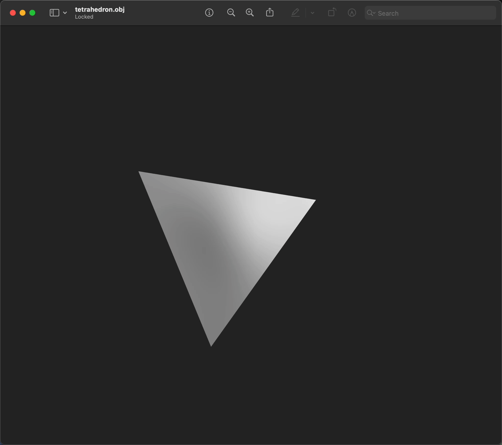

# Tetrahedron (Equilateral Triangular Pyramid)

## Add the tetrahedron module

`src/lib.rs` additions:

```rust
use std::iter::FromIterator;
use truck_meshalgo::prelude::*;

// ...keep `write_polygon_mesh`, `triangle()`, and `square()` above...
pub mod tetrahedron; // add this
pub use tetrahedron::tetrahedron; // add this
```

## Construct Main Function

`src/tetrahedron.rs`:

```rust
use std::iter::FromIterator;
use truck_meshalgo::prelude::*;

/// Equilateral tetrahedron (triangular pyramid).
pub fn tetrahedron() -> PolygonMesh {

    //PLACE STEP 1-4 HERE

}
```

#### Step 1: Define vertex positions
```rust
    let positions = vec![
        Point3::new(0.0, 0.0, 0.0), // base 1 [0]
        Point3::new(1.0, 0.0, 0.0), // base 2 [1]
        Point3::new(0.5, f64::sqrt(3.0) / 2.0, 0.0), // base 3 [2]
        Point3::new(0.5, f64::sqrt(3.0) / 6.0, f64::sqrt(6.0) / 3.0), // apex [3]
    ];
```
#### Step 2: Build attribute set
```rust
    let attrs = StandardAttributes {
        positions,
        ..Default::default()
    };
```
#### Step 3: Define mesh faces
```rust
    let faces = Faces::from_iter([
        [2, 1, 0], // base
        [0, 1, 3], // side 1
        [1, 2, 3], // side 2
        [2, 0, 3], // side 3
    ]);
```


#### Step 4: Construct the mesh

```rust
    PolygonMesh::new(attrs, faces)
```

## Export the tetrahedron

Add `examples/tetrahedron.rs`:

```rust
fn main() {
    let mesh = truck_meshes::tetrahedron();
    truck_meshes::write_polygon_mesh(&mesh, "output/tetrahedron.obj");
}
```

<details>
<summary>What does the `&` mean in `&mesh`?</summary>

`write_polygon_mesh` expects a <a href="https://doc.rust-lang.org/book/ch04-02-references-and-borrowing.html">reference</a> to a `PolygonMesh`, so `&mesh` borrows the mesh instead of moving it. That lets the function read the mesh without taking <a href="https://doc.rust-lang.org/book/ch04-01-what-is-ownership.html">ownership</a>, so you could keep using `mesh` afterward if needed.

</details>

Run it:

```bash
cargo run --example tetrahedron
```

## View it

Open `output/tetrahedron.obj` in Preview/3D Viewer/ParaView/Blender. You should see a single tetrahedron.

*gif below from Preview (mac).*



<details>
<summary>File tree after this step</summary>

```
truck_meshes/
├─ Cargo.toml
├─ src/
│  ├─ lib.rs
│  ├─ triangle.rs
│  ├─ square.rs
│  └─ tetrahedron.rs
├─ examples/
│  ├─ triangle.rs
│  ├─ square.rs
│  └─ tetrahedron.rs
└─ output/          # exported OBJ files (e.g., output/tetrahedron.obj)
```

</details>

<details>
<summary>Full code:</summary>

`src/lib.rs`:

```rust
use std::iter::FromIterator;
use truck_meshalgo::prelude::*;

/// Write any mesh to an OBJ file.
pub fn write_polygon_mesh(mesh: &PolygonMesh, path: &str) {
    let mut obj = std::fs::File::create(path).unwrap();
    obj::write(mesh, &mut obj).unwrap();
}

pub mod triangle;
pub use triangle::triangle;

pub mod square;
pub use square::square;

pub mod tetrahedron;
pub use tetrahedron::tetrahedron;
```

`src/tetrahedron.rs`:

```rust
use std::iter::FromIterator;
use truck_meshalgo::prelude::*;

pub fn tetrahedron() -> PolygonMesh {
    let positions = vec![
        Point3::new(0.0, 0.0, 0.0),
        Point3::new(1.0, 0.0, 0.0),
        Point3::new(0.5, f64::sqrt(3.0) / 2.0, 0.0),
        Point3::new(0.5, f64::sqrt(3.0) / 6.0, f64::sqrt(6.0) / 3.0),
    ];

    let attrs = StandardAttributes {
        positions,
        ..Default::default()
    };

    let faces = Faces::from_iter([
        [2, 1, 0],
        [0, 1, 3],
        [1, 2, 3],
        [2, 0, 3],
    ]);

    PolygonMesh::new(attrs, faces)
}
```

`examples/tetrahedron.rs`:

```rust
fn main() {
    let mesh = truck_meshes::tetrahedron();
    truck_meshes::write_polygon_mesh(&mesh, "output/tetrahedron.obj");
}
```

</details>
