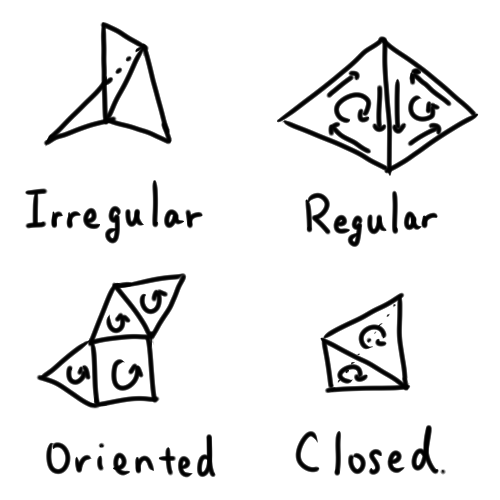

# Mesh Filters

Use Truck’s mesh filters to clean, modify, and analyze meshes before rendering or export.

## Topology conditions

Classify meshes (regular, oriented, closed, etc.):

```rust
let condition = mesh.shell_condition(); // inspect topology flags
println!("{:?}", condition);
```

- **Irregular**: an edge has 3+ faces.
- **Regular**: each edge has at most two faces.
- **Oriented**: no edge appears twice with the same direction.
- **Closed**: every edge appears exactly twice (watertight manifold).



Example (sphere OBJ):

```rust
use truck_meshalgo::prelude::*;

let mut mirror_ball = obj::read(include_bytes!("sphere.obj").as_slice()).unwrap();
println!("default shell condition: {:?}", mirror_ball.shell_condition());
```

## Merge duplicate vertices

Remove seams created by duplicated coordinates:

```rust
// Vertices within 1e-3 are merged
mesh.put_together_same_attrs(1.0e-3);
println!("after merge: {:?}", mesh.shell_condition());
```

## Add normals

Faceted (per-face) normals:

```rust
mesh.add_naive_normals(true); // overwrite existing normals
write_polygon_mesh(&mesh, "output/mirror-ball.obj");
```

Smooth normals (blend across angles):

```rust
// 1.0 rad (~57°) smooths most edges; lower keeps creases
mesh.add_smooth_normals(1.0, true);
write_polygon_mesh(&mesh, "output/mirror-ball-with-smooth-normal.obj");
```

## When to use which

- `put_together_same_attrs`: importing OBJ/patch models, fixing seams, removing duplicate geometry.
- `add_naive_normals(true)`: sharp mechanical parts, crisp reflections, debugging face orientation.
- `add_smooth_normals(angle, true)`: spheres or organic shapes needing soft shading.

## Other cleanup passes

Truck’s filter module (`truck_meshalgo::filters`) also includes:

- `OptimizingFilter`: drop degenerate faces, remove unused attributes, and unify shared vertices beyond simple epsilon merging.
- `StructuringFilter`: reorganize attributes and faces for cache-friendly rendering.

These are helpful after tessellation or mesh imports to slim OBJ/GLTF exports and avoid artifacts when rendering.

## Subdivision and refinement

Use `Subdivision` filters to add detail to coarse meshes (for example, smoothing a low-poly surface before export). Apply subdivision after cleanup so the refined mesh inherits clean topology and normals.

## Save and run

Use the existing `write_polygon_mesh` helper to export OBJ files, then:

```bash
cargo run
```

<details>
<summary>Full example: filter a sphere OBJ (`examples/normals/filter_sphere.rs`)</summary>

```rust
use truck_meshalgo::prelude::*;
use truck_meshes::write_polygon_mesh;

fn main() {
    // Load an OBJ embedded at compile time (replace with your own path if needed)
    let mut mesh: PolygonMesh = obj::read(include_bytes!("sphere.obj").as_slice()).unwrap();
    println!("default shell condition: {:?}", mesh.shell_condition());

    // Merge duplicate vertices within 1e-3
    mesh.put_together_same_attrs(1.0e-3);
    println!("after merge: {:?}", mesh.shell_condition());

    // Flat normals for a faceted look
    mesh.add_naive_normals(true);
    write_polygon_mesh(&mesh, "output/mirror-ball.obj");

    // Smooth normals for softer shading
    mesh.add_smooth_normals(1.0, true); // ~57° crease angle
    write_polygon_mesh(&mesh, "output/mirror-ball-with-smooth-normal.obj");
}
```
</details>

<details>
<summary>Updated directory layout</summary>

```
truck_meshes/
├─ Cargo.toml
├─ src/
│  ├─ lib.rs
│  ├─ shapes/
│  │  ├─ mod.rs
│  │  ├─ triangle.rs
│  │  ├─ square.rs
│  │  ├─ tetrahedron.rs
│  │  ├─ hexahedron.rs
│  │  ├─ octahedron.rs
│  │  ├─ dodecahedron.rs
│  │  └─ icosahedron.rs
│  └─ utils/
│     ├─ mod.rs
│     └─ normal_helpers.rs
   └─ examples/
      ├─ shapes/
      │  ├─ triangle.rs
      │  ├─ square.rs
      │  ├─ tetrahedron.rs
      │  ├─ hexahedron.rs
      │  ├─ octahedron.rs
      │  ├─ dodecahedron.rs
      │  └─ icosahedron.rs
      └─ normals/
         ├─ filter_sphere.rs
         ├─ icosahedron.rs
         └─ sphere.rs
```
</details>

Inspect the results in an OBJ viewer (Preview, Blender, ParaView) to verify topology and normals.
