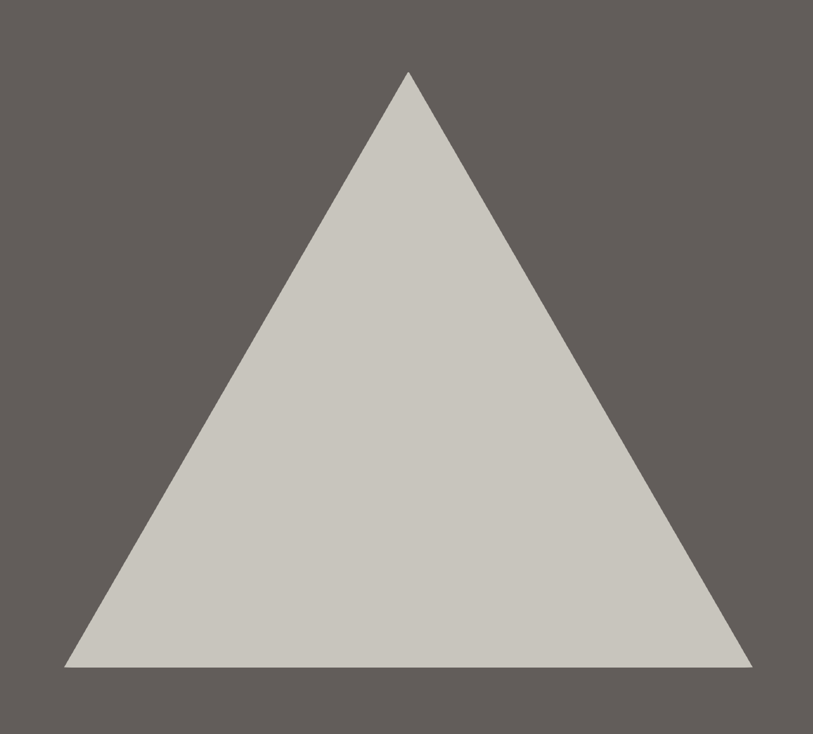

# First Triangle


## Add the triangle module to lib.rs

`src/lib.rs` (root exports + helper):

```rust
use truck_meshalgo::prelude::*;

/// Write any mesh to an OBJ file.
pub fn write_polygon_mesh(mesh: &PolygonMesh, path: &str) {
    let mut obj = std::fs::File::create(path).unwrap();
    obj::write(mesh, &mut obj).unwrap();
}

pub mod triangle; //add this
pub use triangle::triangle; //add this
```

<details>
  <summary>Explanation of <code>pub mod</code> and <code>pub use</code></summary>

  <strong><code>pub mod triangle;</code></strong>
  <ul>
    <li><code>mod triangle;</code> loads the <code>triangle.rs</code> file as a <a href="https://doc.rust-lang.org/rust-by-example/mod.html">module</a>
 in the crate.</li>
    <li>Making it <code>pub</code> exposes that module so other files or external <a href="https://doc.rust-lang.org/rust-by-example/crates.html">crate</a>
 can access its contents.</li>
  </ul>

  <strong><code>pub use triangle::triangle;</code></strong>
  <ul>
    <li><code>use triangle::triangle;</code> imports the <code>triangle()</code> function into the crate root.</li>
    <li>Making it <code>pub</code> re-exports the function so users can call <code>truck_meshes::triangle()</code> without the module <a href="https://en.wikipedia.org/wiki/Path_(computing)">path</a>.</li>
  </ul>
</details>

## Construct Main Function

`src/triangle.rs`:

```rust
use std::iter::FromIterator;
use truck_meshalgo::prelude::*;

/// A single equilateral triangle in the XY plane.
pub fn triangle() -> PolygonMesh {

    //PLACE STEP 1-4 HERE

}
```

#### Step 1: Define vertex positions

```rust
    let positions = vec![
        Point3::new(0.0, 0.0, 0.0), //vertex index: 0
        Point3::new(1.0, 0.0, 0.0), //vertex index: 1
        Point3::new(0.5, f64::sqrt(3.0) / 2.0, 0.0), //vertex index: 2
    ];
```
<details>
<summary>Explanation</summary>

Create three `Point3` coordinates that form an equilateral triangle on the XY plane. Two points sit on the X axis at y = 0, and the third is centered at `x = 0.5` (midway between the base points) with `y = sqrt(3)/2` so all sides are length 1. These positions are the raw vertex data the mesh will consume.

</details>

#### Step 2: Build attribute set

```rust
    let attrs = StandardAttributes {
        positions,
        ..Default::default()
    };
```
<details>
<summary>Explanation</summary>

Store the vertex positions in the [`StandardAttributes`](https://docs.rs/truck-polymesh/latest/truck_polymesh/struct.StandardAttribute.html) struct, which is where a mesh stores all vertex-level attributes (positions, [normals](https://en.wikipedia.org/wiki/Normal_(geometry)), [UVs](https://en.wikipedia.org/wiki/UV_mapping), etc.). We will only set `positions`, and leave every other attribute at its default.

</details>

#### Step 3: Define mesh faces

```rust
    let faces = Faces::from_iter([[0, 1, 2]]);
```
<details>
<summary>Explanation</summary>

Define the triangle by listing the indices of its three vertices. Their counter-clockwise order (0 → 1 → 2) sets the **face orientation**, marking the triangle’s front side as facing the +Z direction.

</details>

<details>
<summary><strong>Face orientation (important)</strong></summary>

- CCW order (counter-clockwise) → face points toward you  
- CW order (clockwise) → face points away  

When looking at the outside, list triangle vertices counter-clockwise.


</details>

#### Step 4: Construct the mesh

```rust
    PolygonMesh::new(attrs, faces)

```
<details>
<summary>Explanation</summary>

Construct the mesh by passing the vertex attributes `attrs` and the face index list `faces` to `PolygonMesh::new`. Each face index (like `[0, 1, 2]`) points into the attribute array, telling the mesh which positions belong to that face. 

The counter-clockwise order of these indices establishes the **face orientation**, which renderers use for lighting, [backface culling](https://en.wikipedia.org/wiki/Back-face_culling), and generating smooth shading. `PolygonMesh::new` combines these into a fully defined mesh ready for rendering or OBJ export.

</details>

## Export the triangle

Add a tiny example at `examples/triangle.rs`:

```rust


fn main() {
    let mesh = truck_meshes::triangle();
    truck_meshes::write_polygon_mesh(&mesh, "output/triangle.obj");
}
```

Run it:

```bash
cargo run --example triangle
```

## View it

Open `output/triangle.obj` in Preview/3D Viewer/ParaView/Blender. You should see a single triangle.

*Image below from ParaView.*



<details>
<summary>File tree after this step</summary>

```
truck_meshes/
├─ Cargo.toml
├─ src/
│  ├─ lib.rs
│  └─ triangle.rs
├─ examples/
│  └─ triangle.rs   (optional helper to export)
└─ output/          # exported OBJ files (e.g., output/triangle.obj)
```

</details>

<details>
<summary>Full code:</summary>

`src/lib.rs`:

```rust
use truck_meshalgo::prelude::*;

pub fn write_polygon_mesh(mesh: &PolygonMesh, path: &str) {
    let mut obj = std::fs::File::create(path).unwrap();
    obj::write(mesh, &mut obj).unwrap();
}

pub mod triangle;
pub use triangle::triangle;
```

`src/triangle.rs`:

```rust
use std::iter::FromIterator;
use truck_meshalgo::prelude::*;

pub fn triangle() -> PolygonMesh {
    let positions = vec![
        Point3::new(0.0, 0.0, 0.0),
        Point3::new(1.0, 0.0, 0.0),
        Point3::new(0.5, f64::sqrt(3.0) / 2.0, 0.0),
    ];

    let attrs = StandardAttributes {
        positions,
        ..Default::default()
    };

    let faces = Faces::from_iter([[0, 1, 2]]);

    PolygonMesh::new(attrs, faces)
}
```
`examples/triangle.rs`:

```rust
fn main() {
    let mesh = truck_meshes::triangle();
    truck_meshes::write_polygon_mesh(&mesh, "output/triangle.obj");
}
```

</details>
