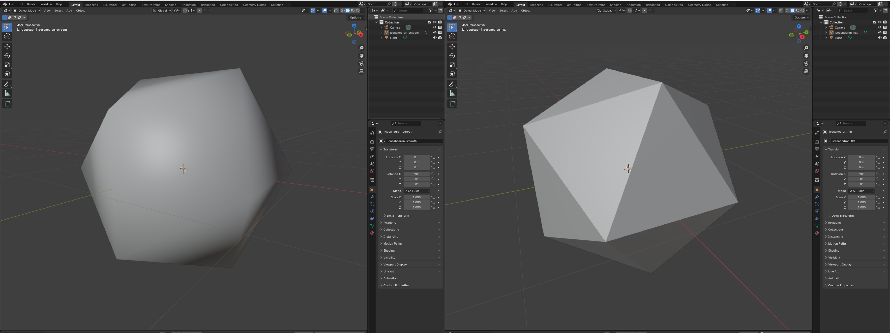

# Normals - Icosahedron

Apply the normal helper functions to the `icosahedron` mesh so you can export both flat (per-face) and smooth (per-vertex) versions.

Use the shared `write_polygon_mesh` helper from `lib.rs` to export OBJ files in these examples.

## Example: flat vs. smooth normals

Create `examples/normals_icosahedron.rs`:

```rust
use truck_meshes::{
    icosahedron,
    add_face_normals,
    add_vertex_normals,
    normalize_vertex_normals,
    write_polygon_mesh,
};

fn main() {
    // Flat shading: one normal per triangle
    let mut flat = icosahedron();
    add_face_normals(&mut flat);
    write_polygon_mesh(&flat, "output/icosahedron_flat.obj");

    // Smooth shading: blended normals per vertex
    let mut smooth = icosahedron();
    add_vertex_normals(&mut smooth);
    normalize_vertex_normals(&mut smooth); // keep them unit length
    write_polygon_mesh(&smooth, "output/icosahedron_smooth.obj");
}

```

Run it and inspect both OBJ files in a viewer to see the difference in shading.


## Direct access to the vectors

If you only need the raw vectors (instead of mutating the mesh), call:

```rust
let mesh = icosahedron();
let face_normals = compute_face_normals(&mesh);     // len() == mesh.faces().len()
let vertex_normals = compute_vertex_normals(&mesh); // len() == mesh.positions().len()
```

<br>

#### Use the face normals when you want a crisp, faceted icosahedron; use the vertex normals when you want a softer, smooth-shaded look.

## View it

in my opinion, the contrast is clearest in [Blender](https://www.blender.org).



<details>
<summary>Updated directory layout</summary>

```
truck_meshes/
├─ Cargo.toml
├─ src/
│  ├─ lib.rs
│  ├─ shapes/
│  │  ├─ mod.rs
│  │  ├─ triangle.rs
│  │  ├─ square.rs
│  │  ├─ tetrahedron.rs
│  │  ├─ hexahedron.rs
│  │  ├─ octahedron.rs
│  │  ├─ dodecahedron.rs
│  │  └─ icosahedron.rs
│  └─ utils/
│     ├─ mod.rs
│     └─ normal_helpers.rs
├─ examples/
│  ├─ triangle.rs
│  ├─ square.rs
│  ├─ tetrahedron.rs
│  ├─ hexahedron.rs
│  ├─ octahedron.rs
│  ├─ dodecahedron.rs
│  ├─ icosahedron.rs
│  └─ normals_icosahedron.rs
└─ output/          # exported OBJ files from examples
```
</details>
