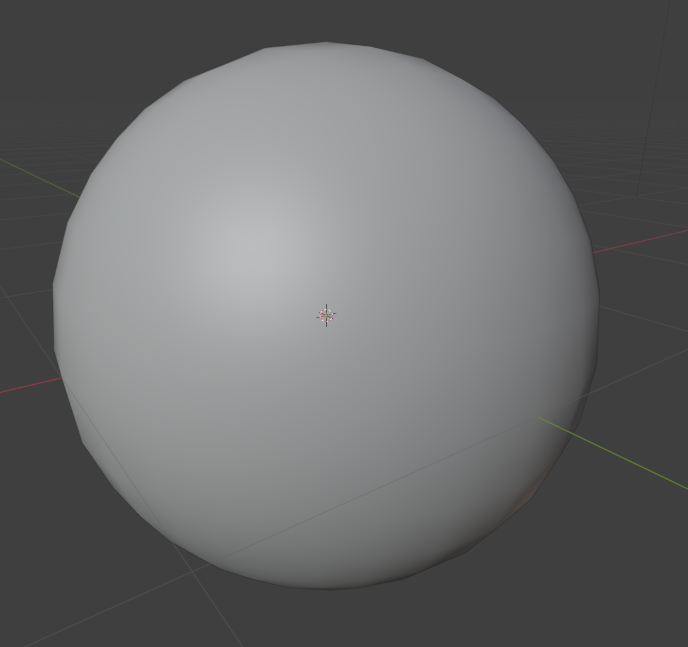

# Normals - Sphere

Vertex normals are what make a low-poly sphere look smooth instead of faceted. Here we’ll inflate a cube into a sphere, assign per-vertex normals, and export an OBJ.

## Why vertex normals change the look

- **Face normals only:** every quad or triangle shades independently; spheres look like mirror balls.
- **Vertex normals:** store one normal per vertex, let the viewer interpolate across the surface; shading appears round.

If a mesh ships without normals, viewers guess differently (Windows/ParaView use face normals; macOS averages adjacent faces). Providing normals removes that guesswork.

## Full example: cube → sphere with normals

Reuse the shared `write_polygon_mesh` helper and `hexahedron()` shape from `lib.rs` to keep the sample lean:

#### Create file `examples/normals_sphere.rs

```rust
use truck_meshalgo::prelude::*;
use truck_meshes::{hexahedron, write_polygon_mesh};

fn main() {

    //STEPS 1-6 GO HERE

}
```

#### Step 1: create hexahedron

```rust
    let hexa = hexahedron();
    // Center the unit cube from the library so projection covers all octants.
    let center = Vector3::new(0.5, 0.5, 0.5);
```

<details>
<summary>What it does</summary>

Pulls in the unit cube mesh from `hexahedron()` and recenters it so projecting to a sphere is symmetric in all directions.
</details>

#### Step 2: subdivide each face

```rust
    const DIVISION: usize = 8;

    // the positions of vertices
    let positions: Vec<Point3> = hexa
        .face_iter()
        .flat_map(|face| {
            // convert face vertex positions into Vec<Vector3>
            let v: Vec<Vector3> = face
                .iter()
                .map(|vertex| (hexa.positions()[vertex.pos] - center).to_vec())
                .collect();

            // create (i,j) grid 0..DIVISION
            (0..=DIVISION)
                .flat_map(move |i| (0..=DIVISION).map(move |j| (i, j)))
                .map(move |(i, j)| {
                    let s = i as f64 / DIVISION as f64;
                    let t = j as f64 / DIVISION as f64;

                    // bilinear interpolation inside the quad
                    v[0] * (1.0 - s) * (1.0 - t)
                        + v[1] * s * (1.0 - t)
                        + v[3] * (1.0 - s) * t
                        + v[2] * s * t
                })
        })
        // project onto the unit sphere
        .map(|vec| Point3::from_vec(vec.normalize()))
        .collect();
```

<details>
<summary>What it does</summary>

Samples each cube face on an `(i,j)` grid, bilinearly interpolates positions inside each quad, and normalizes every point to sit on the unit sphere.
</details>

#### Step 3: compute normals (just position → vector)

```rust
    let normals: Vec<Vector3> = positions.iter().copied().map(Point3::to_vec).collect();
```

<details>
<summary>What it does</summary>

Converts every sphere position into its outward unit vector; for a unit sphere, position and normal share the same direction.
</details>

#### Step 4: attributes

```rust
    let attrs = StandardAttributes {
        positions,
        normals,
        ..Default::default()
    };
```

<details>
<summary>What it does</summary>

Packs the generated positions and normals into `StandardAttributes`, leaving other attributes empty.
</details>

#### Step 5: face construction

```rust
    let faces: Faces = (0..6)
        .flat_map(|face_idx| {
            let base = face_idx * (DIVISION + 1) * (DIVISION + 1);

            // closure to map (i,j) → attribute indices
            let to_index = move |i: usize, j: usize| {
                let idx = base + (DIVISION + 1) * i + j;
                // (pos index, texcoord, normal index)
                (idx, None, Some(idx))
            };

            (0..DIVISION)
                .flat_map(move |i| (0..DIVISION).map(move |j| (i, j)))
                .map(move |(i, j)| {
                    [
                        to_index(i, j),
                        to_index(i + 1, j),
                        to_index(i + 1, j + 1),
                        to_index(i, j + 1),
                    ]
                })
        })
        .collect();
```

<details>
<summary>What it does</summary>

Builds quad faces for each subdivided patch, reusing the same index for both position and normal so the OBJ stays compact.
</details>

#### Step 6: build mesh and export

```rust
    let sphere = PolygonMesh::new(attrs, faces);
    write_polygon_mesh(&sphere, "output/sphere.obj");

    println!("Wrote output/sphere.obj");
}
```

<details>
<summary>What it does</summary>

Creates the final `PolygonMesh` from attributes and faces, writes it to `output/sphere.obj`, and logs the output path.
</details>

##### Final result




## What to look for

- The OBJ contains per-vertex normals, so most viewers will render it smoothly.
- Because positions and normals share indices, the mesh stays compact; if you ever vary normals independently, keep the separate indices pattern shown above.
- Increase `DIVISION` for a denser sphere; shading stays smooth because normals are normalized unit vectors. 

<details>
<summary>Updated directory layout</summary>

```
truck_meshes/
├─ Cargo.toml
├─ src/
│  ├─ lib.rs
│  ├─ shapes/
│  │  ├─ mod.rs
│  │  ├─ triangle.rs
│  │  ├─ square.rs
│  │  ├─ tetrahedron.rs
│  │  ├─ hexahedron.rs
│  │  ├─ octahedron.rs
│  │  ├─ dodecahedron.rs
│  │  └─ icosahedron.rs
│  └─ utils/
│     ├─ mod.rs
│     └─ normal_helpers.rs
├─ examples/
│  ├─ triangle.rs
│  ├─ square.rs
│  ├─ tetrahedron.rs
│  ├─ hexahedron.rs
│  ├─ octahedron.rs
│  ├─ dodecahedron.rs
│  ├─ icosahedron.rs
│  ├─ normals_icosahedron.rs
│  └─ normals_sphere.rs
└─ output/          # exported OBJ files from examples
```
</details>
