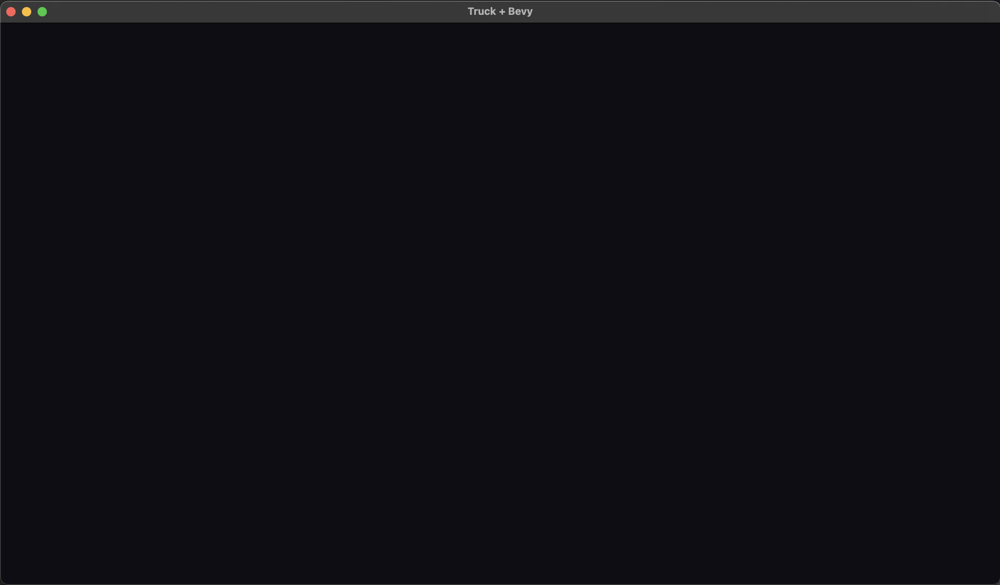

# Bevy Setup

## Dependencies (`Cargo.toml`)

```toml
[dependencies]
bevy = { version = "0.17", features = ["file_watcher"] }
tobj = "4"

```

> Tip: replace `0.17` with the latest version of `bevy` if a newer one is available.

<br>

Install `cargo watch` globally with :

```sh
cargo install cargo-watch
```

## Minimal app

Keep `truck_viewer` as a library crate and provide a small binary that launches it. 
- Put all of your Bevy setup code inside `src/lib.rs`, 
    - have `src/main.rs` simply call the library’s `run()` function.

<br>

### `truck_viewer/src/lib.rs`

```rust
use bevy::prelude::*;
```

<details>
<summary>Why this import?</summary>

`bevy::prelude::*` pulls in common Bevy types (App, commands, components, resources) so the rest of the file stays concise.
</details>

```rust
pub fn build_app() -> App {
    let mut app = App::new();
    app.add_plugins(DefaultPlugins.set(WindowPlugin {
        primary_window: Some(Window {
            title: "Truck + Bevy".into(),
            ..Default::default()
        }),
        ..Default::default()
    }))
    .add_systems(Startup, setup);
    app
}
```

<details>
<summary>What build_app does</summary>

- Creates the Bevy `App`, attaches default plugins, and sets a titled primary window.
- Registers the `setup` system to run once at startup.
- Returns the configured `App` so callers can run or further customize it.
</details>

```rust
pub fn run() {
    build_app().run();
}
```

<details>
<summary>Why a run helper?</summary>

Keeps callers (like `main.rs` or `truck_ui`) from touching Bevy types. They just call `truck_viewer::run()` and let the library handle the internals.
</details>

```rust
fn setup(mut commands: Commands) {
    commands.insert_resource(ClearColor(Color::srgb(0.05, 0.05, 0.08)));
    commands.spawn((
        Camera3d::default(),
        Transform::from_xyz(-2.5, 4.5, 9.0).looking_at(Vec3::ZERO, Vec3::Y),
    ));
}
```

<details>
<summary>What setup seeds</summary>

- Sets a dark clear color so the window isn’t pure black.
- Spawns a default 3D camera positioned to look at the origin, giving a sensible initial view.
</details>

<br>

### `truck_viewer/src/main.rs`

```rust
fn main() {
    truck_viewer::run();
}
```

## Run it

```bash
cargo run
```

<br>

You should see an empty dark window. If it opens, Bevy is ready for rendering Truck meshes.



<details>
<summary>Current truck_viewer layout (after this step)</summary>

```
truck_viewer/
├── Cargo.toml
└── src/
    ├── lib.rs.       # exports build_app/run_with_mesh and sync types
    └── main.rs.      # tiny binary to run the viewer standalone
    ├── app.rs        # sets up plugins, cameras, lights
    └── sync.rs       # sync editor state <-> bevy world
```
</details>
